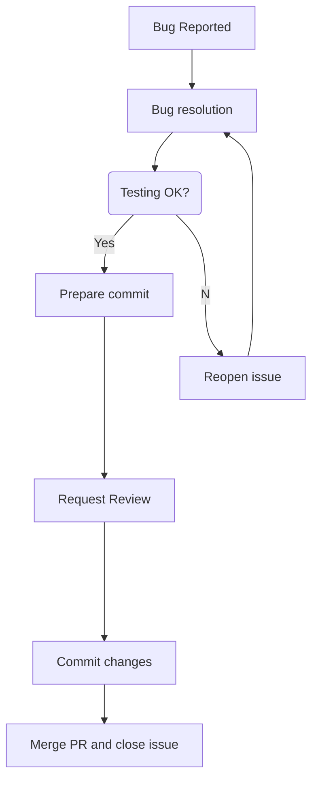

# Contributing to `brainglobe-atlasapi`.

👍🎉 First off, thanks for taking the time to contribute! 🎉👍

When contributing to this repository, please first discuss the change you wish to make via issue, instant message in clara-agx chatbox, or any other method with the owners of this repository before making a change.
Please note we have a [code of conduct](CODE_OF_CONDUCT.md), please follow it in all your interactions with the project.

## :octocat: Setting up project locally.
1. Fork this repo
2. Generate your SSH keys as suggested [here](https://docs.github.com/en/github/authenticating-to-github/generating-a-new-ssh-key-and-adding-it-to-the-ssh-agent)
3. (Optional) setup you commit signature verification as shown [here](https://docs.github.com/en/authentication/managing-commit-signature-verification/about-commit-signature-verification#ssh-commit-signature-verification)
4. Clone the repository by typing (or copying) the following lines in a terminal
```bash
git clone git@github.com:brainglobe/brainglobe-atlasapi.git
```
5. Install conda or uv in your operative system of your machine.
6. Install an editable version of the package; by running `pip install -e ".[dev]"` within the cloned directory
7. Create an issue and branch (as showing in the fellowing section)
8. Create a script to package your atlas, and place into `brainglobe_atlasapi/atlas_generation/atlas_scripts`. Please see other scripts for examples.
  8.1 Your script should contain everything required to run.
  8.2 The raw data should be hosted on a publicly accessible repository so that anyone can run the script to recreate the atlas.

## New issues
* Open an issue (bug report, feature request, or something is not working): https://github.com/brainglobe/brainglobe-atlasapi//issues/new/choose
* Workflow for issue management


## Committing and pushing changes
The following commands are typed or copied via command line.
Alternatively, you can use the features of your integrated development environment (pycharm, code, vim, etc).

1. Clone this repo
```
git clone git@github.com:brainglobe/brainglobe-atlasapi.git
```
2. Create new branch `{FEATURE_BRANCH_NAME}` using issue number `{ISSUE_NUMBER}`
```
git checkout -b ISSUE_NUMBER-FEATURE_BRANCH_NAME #(e.g. `git checkout -b 422-my-feature-branch`)
```
3. Commit changes and push to your branch
```
git add .
git commit -m 'short message #ISSUE_NUMBER' #(e.g. git commit -m 'adding a message to my feature branch #422'
git push origin ISSUENUMBER-branch-name
```
4. Submit a Pull Request against the `main` branch.

## Pull Request (PR) and merge to `main` branch
1. Select branch that contain your commits.
2. Click `Compare and pull request` and create PR for the associated branch.
3. Type a title and description of your PR and create PR
4. Please keep your PR in sync with the base branch.
It is recommended that you use [Squashing and merging a long-running branch](https://docs.github.com/en/pull-requests/collaborating-with-pull-requests/incorporating-changes-from-a-pull-request/about-pull-request-merges#squashing-and-merging-a-long-running-branch).
Otherwise, you have the option to rebase your `{ISSUE_NUMBER-FEATURE_BRANCH_NAME}` branch with the base branch (e.g. `main`).
```
## MERGING using merge main
git fetch
git merge main
git push origin ISSUE_NUMBER_FEATURE_BRANCH
## MERGING using rebase
git checkout main
git pull origin main
git checkout ISSUE_NUMBER_FEATURE_BRANCH #(e.g. git checkout 422-my-feature-branch)
git fetch
git rebase main
## RESOLVING CONFLICTS IN THE TERMINAL
# git status
# edit conflicting files with `vim` editor
# git add .
# git rebase --continue
git push --force origin ISSUE_NUMBER_FEATURE_BRANCH
## OTHER COMMANDS
git push --force origin ISSUE_NUMBER_FEATURE_BRANCH
git pull --rebase origin ISSUE_NUMBER_FEATURE_BRANCH
```
5. Run `pre-commit run -a` to tidy up code and documentation.
6. If you are developing in your local host, please check that your code is properly tested with `pytest`.
7. Request a PR review.
See [collaborating-with-pull-requests](https://docs.github.com/en/pull-requests/collaborating-with-pull-requests) for further details.
8. Once your PRs has been approved, procced to merge it to main. See [Merging a pull request](https://docs.github.com/en/pull-requests/collaborating-with-pull-requests/incorporating-changes-from-a-pull-request/merging-a-pull-request)
9. Delete and remove your merged branch
9.1 You can navigate branches in https://github.com/brainglobe/brainglobe-atlasapi/branches and removed merged branches by clickling :wastebasket: icon.
9.2 Alternatively, you can delete your local and merged branches using the following commands:
```
#Local git clear
git branch --merged | grep -v '\*\|master\|main\|develop' | xargs -n 1 git branch -d
#Remote git clear
git branch -r --merged | grep -v '\*\|master\|main\|develop' | sed 's/origin\///' | xargs -n 1 git push --delete origin
```

## Add packages to `pyproject.toml`
If you need to add any dependencies, please add them as an extra in the `pyproject.toml` file, e.g.:

```python
[project.optional-dependencies]
allenmouse = ["allensdk"]
newatlas = ["dependency_1", "dependency_2"]
```
