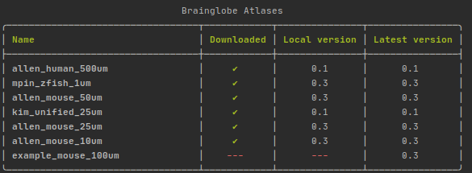

[](https://pypi.org/project/bg-atlasapi)
[](https://pypi.org/project/bg-atlasapi/)
[](https://pypi.org/project/bg-atlasapi)
[](https://github.com/SainsburyWellcomeCentre/brainatlas-api)
[](
    https://travis-ci.com/brainglobe/bg-atlasapi)
[](https://coveralls.io/github/brainglobe/brainatlas-api?branch=master)
[](https://github.com/python/black)


# BG-AtlasAPI
A lightweight python module to interact with atlases for systems neuroscience

## Introduction
Many excellent brain atlases exist for different species. Some of them have an API (application programming interface) to allow users to interact with the data programmatically (e.g. the excellent [Allen Mouse Brain Atlas](www.brain-map.org)), but many do not, and there is no consistent way to process data from multiple sources.

The brainglobe atlas API (BG-AtlasAPI) deals with this problem by providing a common interface for programmers to download and process data from multiple sources. 

Each atlas consists of data files in a common format:
* A "reference" image of a brain (`.tiff`)
* An "annotation" image, with each brain region defined by a unique pixel value (`.tiff`)
* Meshes defining the surface of each brain region (`.obj`)
* A mapping of brain region pixel value to region name, and structure hierarchy (`.json`)
* Metadata defining the shape, orientation etc. of the data, and other info such as animal species and authors (`.json`)

## Atlases available

A number of atlases are in development, but those available currently are:
* The [Allen Mouse Brain Atlas](www.brain-map.org) at 10, 25 and 50 micron resolutions
* The [Allen Human Brain Atlas](www.brain-map.org) at 100 micron resolution
* The [Max Planck Zebrafish Brain Atlas](http://fishatlas.neuro.mpg.de) at 1 micron resolution
* The [Enhanced and Unified Mouse Brain Atlas](https://kimlab.io/brain-map/atlas/) at 25 micron resolution

## Installation
BG-AtlasAPI works with Python >3.6, and can be installed from PyPI with:
```bash
pip install bg-atlasapi
```

## Usage
### Python API
**List of atlases**

To see a list of atlases use `bg_atlasapi.show_atlases`
```python
from bg_atlasapi import show_atlases
show_atlases()
#                                Brainglobe Atlases                               
# ╭──────────────────────────────────┬────────────┬───────────────┬──────────────╮
# │ Name                             │ Downloaded │ Local version │    Latest    │
# │                                  │            │               │   version    │
# ├──────────────────────────────────┼────────────┼───────────────┼──────────────┤
# │ allen_human_500um                │     ✔      │      0.1      │     0.1      │
# │ mpin_zfish_1um                   │     ✔      │      0.3      │     0.3      │
# │ allen_mouse_50um                 │     ✔      │      0.3      │     0.3      │
# │ kim_unified_25um                 │     ✔      │      0.1      │     0.1      │
# │ allen_mouse_25um                 │     ✔      │      0.3      │     0.3      │
# │ allen_mouse_10um                 │     ✔      │      0.3      │     0.3      │
# │ example_mouse_100um              │    ---     │      ---      │     0.3      │
# ╰──────────────────────────────────┴────────────┴───────────────┴──────────────╯
```

**Using the atlases**

All the features of each atlas can be accessed via the `BrainGlobeAtlas` class. 

Each atlas can be instantiated by passing the name of the atlas to the class. The files will be downloaded (if necessary) upon instantiation of the class.

e.g. for the 25um Allen Mouse Brain Atlas:

```python
from bg_atlasapi.bg_atlas import BrainGlobeAtlas
atlas = BrainGlobeAtlas("allen_mouse_25um")
```

The various files associated with the atlas can then be accessed as attributes of the class:
```python
# reference image
reference_image = atlas.reference
print(reference_image.shape)
# (528, 320, 456)

# annotation image
annotation_image = atlas.annotation
print(annotation_image.shape)
# (528, 320, 456)

# a hemispheres image (value 1 in left hemisphere, 2 in right) can be generated
hemispheres_image = atlas.hemispheres
print(hemispheres_image.shape)
# (528, 320, 456)
```

**Brain regions**

There are multiple ways to work with individual brain regions. To see a dataframe of each brain region, with it's unique ID, acronym and full name, use `atlas.lookup_df`:
```python
atlas.lookup_df.head(10)
#      acronym         id                           name
# 0       root        997                           root
# 1       grey          8  Basic cell groups and regions
# 2         CH        567                       Cerebrum
# 3        CTX        688                Cerebral cortex
# 4      CTXpl        695                 Cortical plate
# 5  Isocortex        315                      Isocortex
# 6        FRP        184  Frontal pole, cerebral cortex
# 7       FRP1         68          Frontal pole, layer 1
# 8     FRP2/3        667        Frontal pole, layer 2/3
# 9       FRP5  526157192          Frontal pole, layer 5
```

Each brain region can also be access by the acronym, e.g. for primary visual cortex (VISp):
```python
from pprint import pprint
VISp = atlas.structures["VISp"]
pprint(VISp)
# {'acronym': 'VISp',
#  'id': 385,
#  'mesh': None,
#  'mesh_filename': PosixPath('/home/user/.brainglobe/allen_mouse_25um_v0.3/meshes/385.obj'),
#  'name': 'Primary visual area',
#  'rgb_triplet': [8, 133, 140],
#  'structure_id_path': [997, 8, 567, 688, 695, 315, 669, 385]}
```


**Metadata**

Information about each atlas can be found using the `atlas.metadata` dictionary:

```python
print(atlas.metadata["orientation"])
# asl 
print(atlas.metadata["citation"])
# Wang et al 2020, https://doi.org/10.1016/j.cell.2020.04.007
```


To understand and manipulate the atlas orientation information, please see [bg-space](https://github.com/brainglobe/bg-space).

### Command line interface
Although the atlases will be downloaded when you need them, we provide a command line interface to view which atlases are available, and update them if necessary.

To see the list of atlases available, run `brainglobe list`


To download an atlas, use `brainglobe install` , the `-a` flag, followed by the name of the atlas, e.g.:
```bash
brainglobe install -a allen_mouse_25um
```

To update an atlas to a newer version, use `brainglobe update`, e.g.:
```bash
brainglobe update -a allen_mouse_25um
```
Further instructions can be found by running `brainglobe --help`

### Using the files directly
Although the API should provide you with the tools you need to work with the atlas (and if they don't, please [raise an issue](https://github.com/brainglobe/bg-atlasapi/issues)), you may wish to find the files themselves.

By default, atlases will be downloaded and saved into your home directory in a hidden directory (`.brainglobe`), with one directory per atlas e.g. `/home/username/.brainglobe/allen_mouse_10um_v0.3`).

In each atlas directory, there will be the following sub-directories and files:
* `reference.tiff` The "template" brain image, i.e. a structural image of the brain (or average of brains) in which the annotations are defined
* `annotation.tiff` An image of the same shape as `reference.tiff` but in which each pixel value corresponds to a unique brain area. A pixel value of 0 typically refers to areas outside the brain
* `meshes` A directory of mesh files (as `.obj`) for each brain region, defined by the unique region ID
* `structures.json` A file describing the mapping of brain region ID to region name, and the hierarchy of brain structures
* `metadata.json` A file containing the atlas metadata, such as the shape of the images, the anatomical orientation, and the details of the source of the atlas
* `README.txt` A human readable version of the metadata and brain region hierarchies


