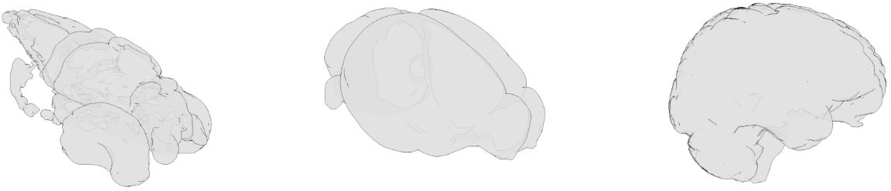

[](https://pypi.org/project/bg-atlasapi)
[](https://pypi.org/project/bg-atlasapi/)
[](https://pypi.org/project/bg-atlasapi)
[](https://github.com/SainsburyWellcomeCentre/brainatlas-api)
[](
    https://travis-ci.com/brainglobe/bg-atlasapi)
[](https://coveralls.io/github/brainglobe/brainatlas-api?branch=master)
[](https://github.com/python/black)



The brainglobe atlas API (BG-AtlasAPI) provides a common interface for programmers to download and process brain atlas data from multiple sources. 

## Atlases available

A number of atlases are in development, but those available currently are:
* The [Allen Mouse Brain Atlas](www.brain-map.org) at 10, 25 and 50 micron resolutions
* The [Allen Human Brain Atlas](www.brain-map.org) at 100 micron resolution
* The [Max Planck Zebrafish Brain Atlas](http://fishatlas.neuro.mpg.de) at 1 micron resolution
* The [Enhanced and Unified Mouse Brain Atlas](https://kimlab.io/brain-map/atlas/) at 25 micron resolution

## Installation
BG-AtlasAPI works with Python >3.6, and can be installed from PyPI with:
```bash
pip install bg-atlasapi
```

## Usage
Full information can be found in the [documentation](https://docs.brainglobe.info/bg-atlasapi/usage)
### Python API
**List of atlases**

To see a list of atlases use `bg_atlasapi.show_atlases`
```python
from bg_atlasapi import show_atlases
show_atlases()
#                                Brainglobe Atlases                               
# ╭──────────────────────────────────┬────────────┬───────────────┬──────────────╮
# │ Name                             │ Downloaded │ Local version │    Latest    │
# │                                  │            │               │   version    │
# ├──────────────────────────────────┼────────────┼───────────────┼──────────────┤
# │ allen_human_500um                │     ✔      │      0.1      │     0.1      │
# │ mpin_zfish_1um                   │     ✔      │      0.3      │     0.3      │
# │ allen_mouse_50um                 │     ✔      │      0.3      │     0.3      │
# │ kim_unified_25um                 │     ✔      │      0.1      │     0.1      │
# │ allen_mouse_25um                 │     ✔      │      0.3      │     0.3      │
# │ allen_mouse_10um                 │     ✔      │      0.3      │     0.3      │
# │ example_mouse_100um              │    ---     │      ---      │     0.3      │
# ╰──────────────────────────────────┴────────────┴───────────────┴──────────────╯
```

**Using the atlases**

All the features of each atlas can be accessed via the `BrainGlobeAtlas` class. 


e.g. for the 25um Allen Mouse Brain Atlas:

```python
from bg_atlasapi.bg_atlas import BrainGlobeAtlas
atlas = BrainGlobeAtlas("allen_mouse_25um")
```

The various files associated with the atlas can then be accessed as attributes of the class:
```python
# reference image
reference_image = atlas.reference
print(reference_image.shape)
# (528, 320, 456)

# annotation image
annotation_image = atlas.annotation
print(annotation_image.shape)
# (528, 320, 456)

# a hemispheres image (value 1 in left hemisphere, 2 in right) can be generated
hemispheres_image = atlas.hemispheres
print(hemispheres_image.shape)
# (528, 320, 456)
```

**Brain regions**

There are multiple ways to work with individual brain regions. To see a dataframe of each brain region, with it's unique ID, acronym and full name, use `atlas.lookup_df`:
```python
atlas.lookup_df.head(8)
#      acronym         id                           name
# 0       root        997                           root
# 1       grey          8  Basic cell groups and regions
# 2         CH        567                       Cerebrum
# 3        CTX        688                Cerebral cortex
# 4      CTXpl        695                 Cortical plate
# 5  Isocortex        315                      Isocortex
# 6        FRP        184  Frontal pole, cerebral cortex
# 7       FRP1         68          Frontal pole, layer 1
```

Each brain region can also be access by the acronym, e.g. for primary visual cortex (VISp):
```python
from pprint import pprint
VISp = atlas.structures["VISp"]
pprint(VISp)
# {'acronym': 'VISp',
#  'id': 385,
#  'mesh': None,
#  'mesh_filename': PosixPath('/home/user/.brainglobe/allen_mouse_25um_v0.3/meshes/385.obj'),
#  'name': 'Primary visual area',
#  'rgb_triplet': [8, 133, 140],
#  'structure_id_path': [997, 8, 567, 688, 695, 315, 669, 385]}
```
